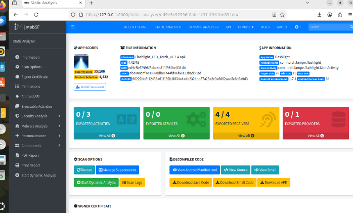
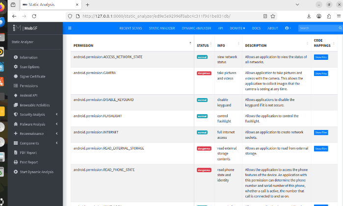
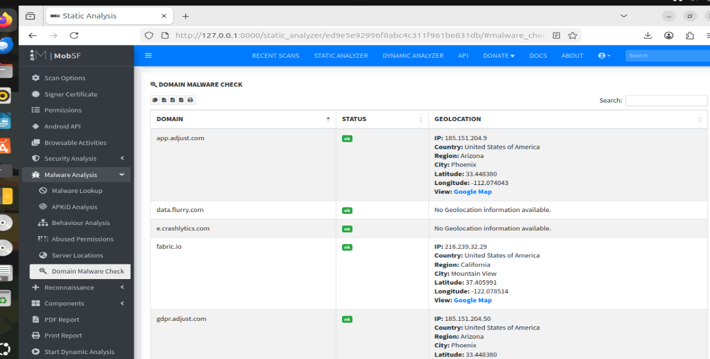
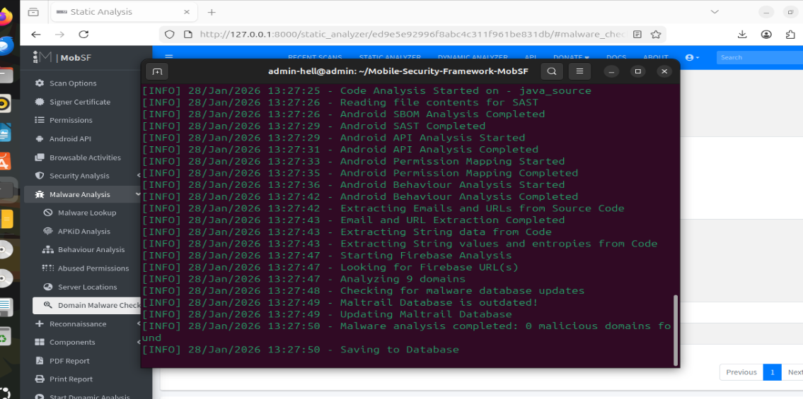

# Automated-Mobile-Application-Security-Assessment-using-MobSF

Project Overview
This project demonstrates an automated approach to identifying security vulnerabilities in Android applications using the Mobile Security Framework (MobSF). The goal is to detect potential threats such as data leaks, excessive permissions, and malicious connections.
Key Features Analyzed
Security Scoring: Evaluates the overall security posture of the APK (e.g., Score: 55/100).
Permission Analysis: Identifies dangerous permissions that could lead to an Abuse of Permissions.
Malware Detection: Checks for Unknown Processes and suspicious code patterns.
Network Security: Monitors for Suspicious Network Connections to unauthorized domains.
Technical Stack
Framework: MobSF (Mobile Security Framework)
Environment: Ubuntu 24.04
Language: Python 3.12 & Java 17
How to Run
Navigate to the MobSF directory.
Start the server: ./run.sh 127.0.0.1:8000.
Access the dashboard via browser at http://127.0.0.1:8000.
Screenshots

Dashboard: Shows the security score and file summary.
Vulnerability Report: Detailed list of security flaws.
